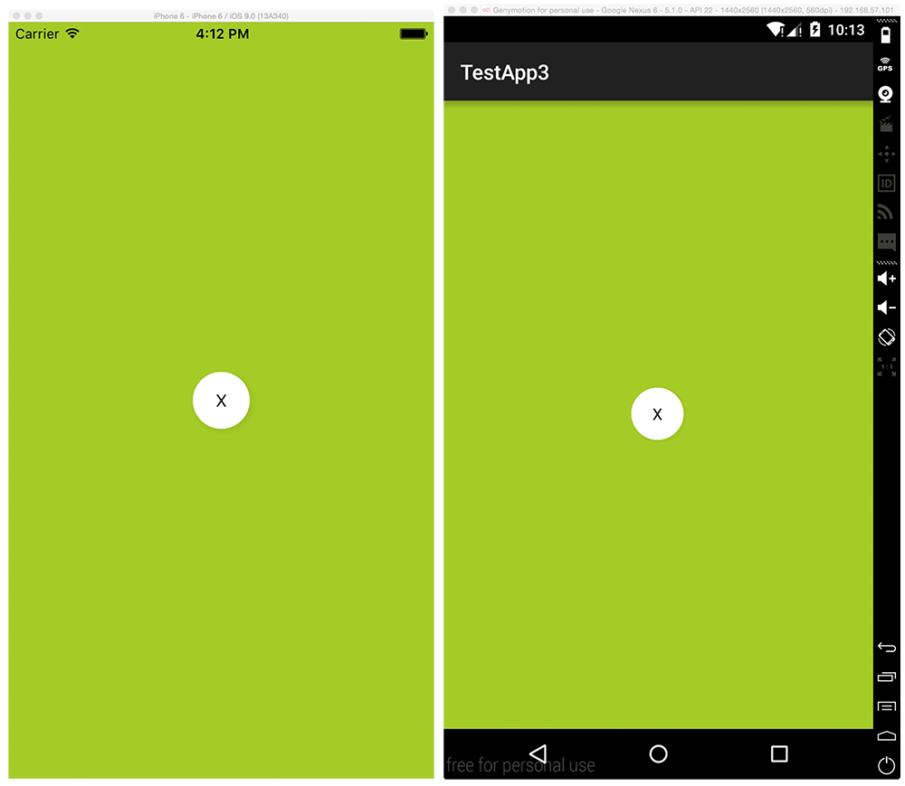

# Alloy *Android Shadow* widget [](http://www.appcelerator.com/alloy/)
The *Android Shadow* widget adds a shadow to an enclosed view for Android. As the viewShadowColor property/option is lacking for Android in the Titanium SDK.

## Quick Start

### Get it [](http://gitt.io/component/com.karaoak.shadow)
Download this repository and consult the [Alloy Documentation](http://docs.appcelerator.com/titanium/latest/#!/guide/Alloy_XML_Markup-section-35621528_AlloyXMLMarkup-ImportingWidgets) on how to install it, or simply use the [gitTio CLI](http://gitt.io/cli):

`$ gittio install com.karaoak.shadow`

### Use it

* Add the widget to your *View:

	```xml
	<Alloy>
	<Window class="container">		
		<Widget src="com.karaoak.shadow" shadowColor="#44000000">
            <View id="myControl" onClick="myControlAction">
                <Button class="icon noTouch" platform="ios" />
                <Label class="icon noTouch" platform="android" id="myControlIcon" />
            </View>
        </Widget>
	</Window>
</Alloy>	
```

### Sample
See the example folder for a working example.

### Preview



## License

<pre>
Copyright 2015 Frank Eijking

Licensed under the Apache License, Version 2.0 (the "License");
you may not use this file except in compliance with the License.
You may obtain a copy of the License at

   http://www.apache.org/licenses/LICENSE-2.0

Unless required by applicable law or agreed to in writing, software
distributed under the License is distributed on an "AS IS" BASIS,
WITHOUT WARRANTIES OR CONDITIONS OF ANY KIND, either express or implied.
See the License for the specific language governing permissions and
limitations under the License.
</pre>
